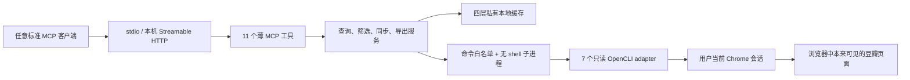

# Cove Douban MCP

一个独立、可开源、默认只读的豆瓣 MCP 服务。它把本地 Chrome
中已经可见的豆瓣信息，通过标准 Model Context Protocol 提供给
Claude Code、Codex、桌面客户端、编辑器插件，以及开发者自己的前端或后端。

项目支持 macOS 与 Windows，提供 stdio 和仅限本机回环地址的
Streamable HTTP。它不依赖 Cove 主程序，也不会读取或修改任何 Cove 数据。

> 本项目与豆瓣无隶属、合作或官方授权关系。请遵守豆瓣条款、当地法律和账号
> 权限边界，仅访问你本来就有权在浏览器中查看的内容。

## 核心边界

- 豆瓣侧永久只读：不标记、不评分、不发影评、不改豆列、不改账号。
- 不索取、不导出、不持久化 Cookie；不复制 Chrome profile。
- 默认只写自己的缓存目录。
- Markdown 导出功能存在，但默认关闭。
- `confirm_each` 模式下，模型只能发起一次性提案，不能批准自己的提案。
- 本地 HTTP 只能绑定 `127.0.0.1`、`localhost` 或 `::1`，并强制 Bearer
  鉴权和浏览器 Origin 检查。
- 安装前检测同名 OpenCLI adapter；默认绝不覆盖。
- 卸载时仅删除哈希仍与安装包一致的 adapter，用户后来改过的文件会保留。

## 能做什么

首个版本保留现有完整能力：

| MCP 工具 | 能力 |
|---|---|
| `douban_status` | 本地连接、权限、缓存和同步状态 |
| `douban_search` | 搜索电影、图书、音乐 |
| `douban_subject` | 查询电影或图书详情 |
| `douban_movie_marks` | 查询、筛选、分页“看过 / 想看 / 在看” |
| `douban_reviews` | 查询个人影评，可选完整正文 |
| `douban_movie_profile` | 汇总多个观影状态 |
| `douban_doulists` | 查询豆列、片单、书单 |
| `douban_doulist_items` | 查询一个列表里的条目 |
| `douban_sync` | 刷新本地只读缓存 |
| `douban_working_cache_read` | 分页读取完整服务端结果 |
| `douban_export_markdown` | 按本地权限策略导出 Markdown |

热门榜单、Top 250 等新能力可以在后续版本以新增工具的方式加入，不会破坏
这 11 个 v0.1.0 工具的合同。

## 架构



领域层负责标准化、筛选、分页、非缩水合并和不透明结果引用；MCP 层不直接
解析网页。两种传输共用同一个服务容器，因此结果合同一致。

## 系统要求

- macOS 13 或更新版本，或受支持的 Windows 10/11；
- Python 3.11、3.12 或 3.13；
- [uv](https://docs.astral.sh/uv/)（推荐）或能安装 Python wheel 的工具；
- Node.js 22；
- OpenCLI 1.8.x；
- Chrome，以及可用的 OpenCLI Browser Bridge；
- 已在该 Chrome 会话中正常登录豆瓣。

本项目不会自动升级全局 OpenCLI。`doctor` 会报告版本不匹配并给出处理建议。

## 安装

仓库发布前，可在克隆目录中安装：

```bash
uv tool install .
```

发布到包索引后：

```bash
uv tool install cove-douban-mcp
```

先看安装计划，不改任何文件：

```bash
cove-douban-mcp setup --dry-run
```

确认后安装默认配置和七个只读 adapter：

```bash
cove-douban-mcp setup --yes
```

`setup` 不会修改任何 MCP 客户端配置。它会输出一份通用配置，用户自行决定
放进哪个客户端。

## 连接任意 MCP 客户端

### stdio（推荐）

完整示例见 [examples/generic-stdio.json](examples/generic-stdio.json)：

```json
{
  "mcpServers": {
    "douban": {
      "command": "cove-douban-mcp",
      "args": ["serve", "--transport", "stdio"]
    }
  }
}
```

这是一份标准 MCP stdio 配置，不绑定某个厂商。若客户端使用不同字段名，请
把同一条 command/args 映射进去即可。

### 本机 Streamable HTTP

启动：

```bash
cove-douban-mcp serve --transport streamable-http
```

默认端点是 `http://127.0.0.1:8765/mcp`。首次启动会在应用数据目录生成
至少 256 位的本地 token；服务不会把 token 打到日志或 MCP 结果中。
macOS 使用仅限文件所有者的权限，Windows 使用 `icacls` 移除继承权限并
只授权当前用户；如果无法建立这层保护，本地 HTTP 会拒绝启动并清理新令牌。

完整结构见
[examples/generic-streamable-http.json](examples/generic-streamable-http.json)。
浏览器前端不应把 token 写进源码；请由同机后端代持，或使用 stdio。

随时生成通用配置：

```bash
cove-douban-mcp print-config --transport stdio
cove-douban-mcp print-config --transport streamable-http
```

## 首次使用

1. 在 Chrome 中正常打开豆瓣并完成登录。
2. 确认 OpenCLI Browser Bridge 可用。
3. 运行 `cove-douban-mcp doctor --json`。
4. 在 MCP 客户端调用 `douban_status`。
5. 用 `douban_search` 或 `douban_movie_marks` 做第一条只读查询。

`doctor` 不执行私有账号数据抓取，只检查本地文件、插件和 OpenCLI 可执行文件。

## 缓存与同步

应用使用四层缓存：

- 六小时、有上限的普通查询缓存；
- “看过 / 想看 / 在看”的非缩水持久基线；
- 同步状态；
- 24 小时、按客户端隔离的不透明完整结果引用。

筛选发生在分页之前。普通增量更新只会补充或丰富旧条目，不会因为一次网页
只返回部分内容而把历史基线截短。

默认同步状态为启用，每日目标时间为本地 `05:10`，默认同步 `wish`、
`collect` 和豆列。手动调用 `douban_sync` 始终只写内部缓存，不写豆瓣。

## 可选 Markdown 导出

默认：

```toml
[export]
enabled = false
policy = "off"
```

允许每次人工确认：

```bash
cove-douban-mcp permissions export \
  --policy confirm_each \
  --root "/path/selected/by/user"
```

允许在一个固定根目录内直接写：

```bash
cove-douban-mcp permissions export \
  --policy allow_in_root \
  --root "/path/selected/by/user"
```

Windows PowerShell 同样使用用户自己选择的绝对路径：

```powershell
cove-douban-mcp permissions export `
  --policy confirm_each `
  --root "D:\Documents\DoubanExports"
```

人工提案命令：

```bash
cove-douban-mcp export list
cove-douban-mcp export show <proposal-id>
cove-douban-mcp export approve <proposal-id>
cove-douban-mcp export reject <proposal-id>
```

导出只接受 `.md` 和 `.markdown`，会拒绝 `..`、根目录外绝对路径、符号链接
逃逸和 Windows junction/reparse-point 逃逸。`replace` 只替换本项目标记的
生成区块，并先创建可恢复备份。

## 数据位置

macOS：

```text
~/Library/Application Support/cove-douban-mcp/
```

Windows：

```text
%LOCALAPPDATA%\cove-douban-mcp\
```

其中只有配置、缓存、同步状态、提案、脱敏诊断信息和本地 HTTP
凭据；没有 Cookie、密码、Chrome profile 或 MCP 对话历史。

## 卸载

移除 OpenCLI 集成、保留缓存和配置：

```bash
cove-douban-mcp uninstall --yes
```

连应用数据一起清除需要第二次明确确认：

```bash
cove-douban-mcp uninstall --yes --purge-data --confirm-purge
```

无论哪种方式，都不会删除已经导出的 Markdown。

## 开发

```bash
uv sync --all-groups
uv run ruff check .
uv run mypy src
uv run pytest -q
npm --prefix opencli-plugin ci
npm --prefix opencli-plugin test
```

默认测试完全使用合成数据，不连接豆瓣。参见
[CONTRIBUTING.md](CONTRIBUTING.md)。

## 安全、隐私与排障

- [安全设计](docs/security.md)
- [隐私说明](docs/privacy.md)
- [故障排查](docs/troubleshooting.md)
- [漏洞报告政策](SECURITY.md)

## 许可证

Apache License 2.0。第三方归属见 [NOTICE](NOTICE)。
